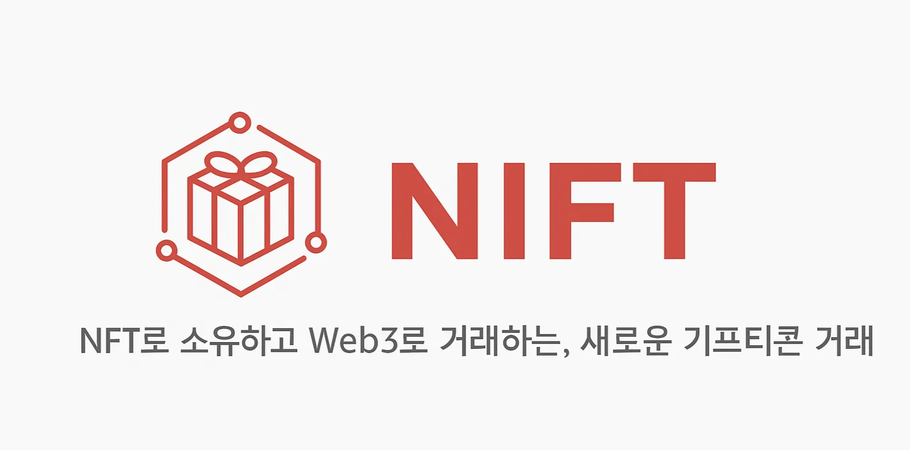
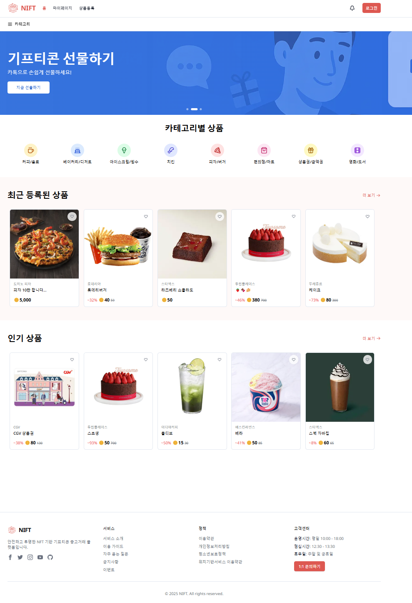
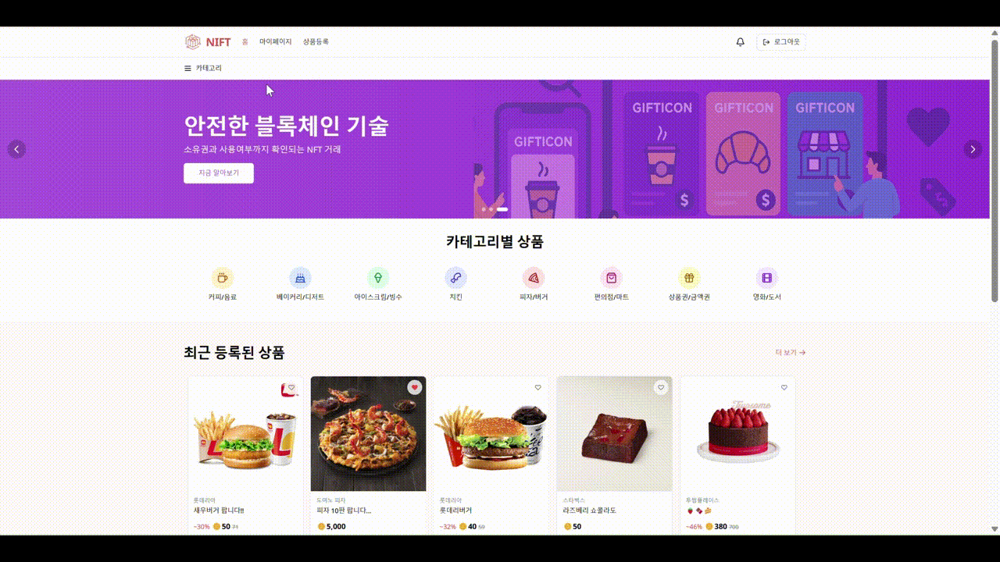
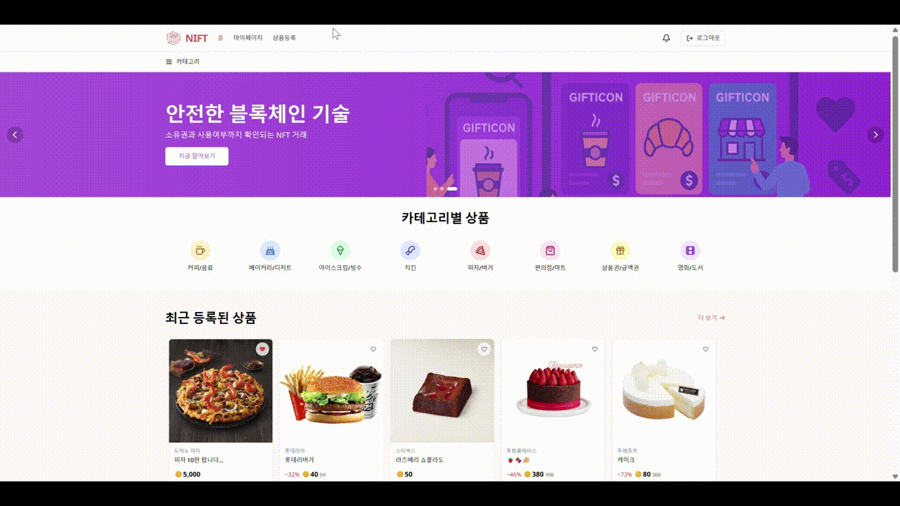
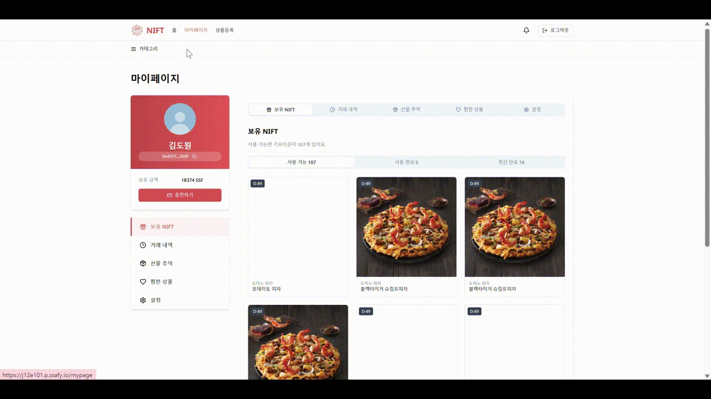
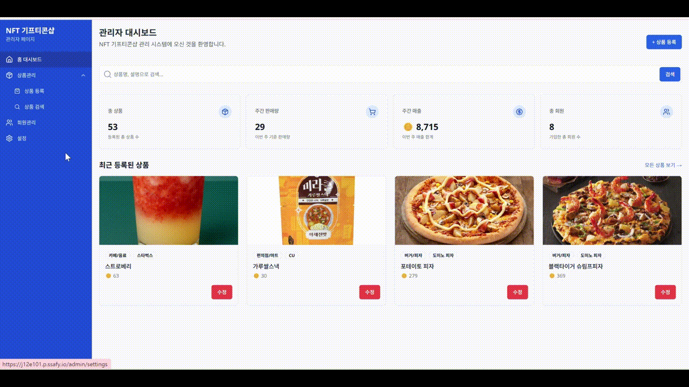
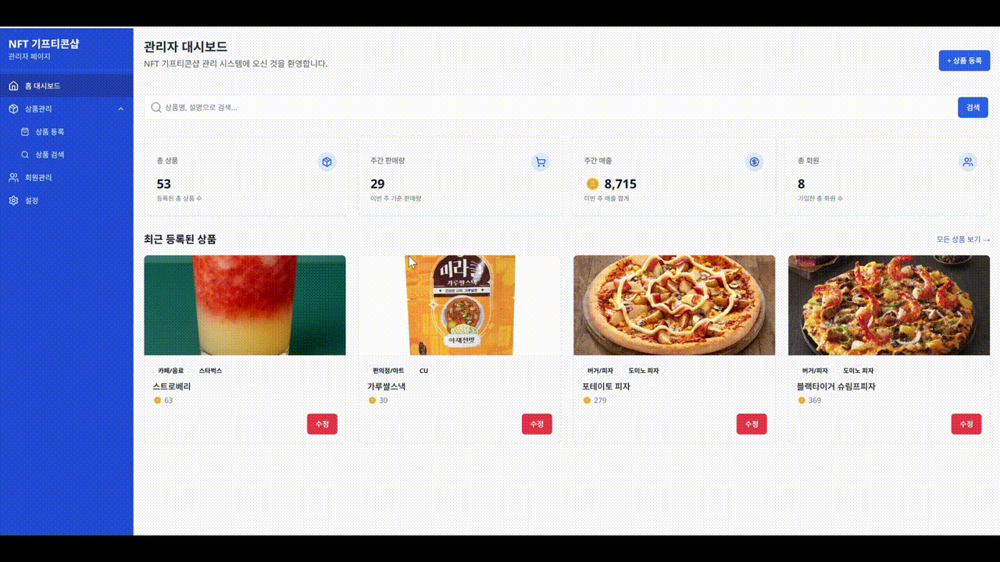

# README

생성자: 도원 김
생성 일시: 2025년 4월 10일 오전 9:44
카테고리: 산출물

# **📌**목차

---

1. [서비스 소개](#서비스-소개)
2. [팀 구성](#팀-구성)
3. [주요 기능](#주요-기능)
4. [주요 기술](#주요-기술)
5. [산출물](#산출물) (최종발표자료, 아키텍쳐, 디자인, 요구사항 명세서, ERD, API 명세서)

# 🎁**서비스 소개**

---

### **⌛프로젝트 기간**

**2025.03.03 ~ 2025.04.11 (6주)**

## 📖 개요

**SSAFY 12기 2학기 특화 프로젝트**

**NIFT**는 NFT(Non-Fungible Token)를 활용하여 **실물 기프티콘을 블록체인 상에서 안전하게 거래**할 수 있도록 지원하는 플랫폼입니다.

기프티콘은 선물, 중고 거래, 사용까지 다양한 흐름을 가지지만, 현재의 기프티콘 생태계는 위·변조 위험, 거래의 불편함, 사용 이력 추적의 어려움 등의 문제를 안고 있습니다.

NIFT는 이러한 문제를 해결하기 위해, **기프티콘을 NFT로 민팅하고**, **사용 이력과 소유권을 블록체인에 투명하게 기록**함으로써 누구나 안전하게 기프티콘을 거래하고, 선물할 수 있는 환경을 제공합니다.

또한, **메타마스크를** 통한 Web3 지갑 연동, **QR 기반 실사용** 등을 통해 **NFT의 실생활 활용 가능성**을 높이는 데 중점을 두었습니다.

> **“NFT는 더 이상 디지털 자산의 끝이 아니라, 실물 소비의 새로운 시작입니다.**
> 

# 👥팀 구성

---

# 🚀주요 기능

---

### 👤 사용자 사이트

 **메인 페이지** 

    - **최근 등록 상품 및 인기 상품 조회**
        
        
        
        - 최근 등록된 상품 및 인기 상품을 조회할 수 있습니다.
    - **소셜 로그인**
        
        
        
        - 소셜 로그인(카카오톡)을 통해 로그인 할 수 있습니다.

 **마이페이지** 

    - **지갑 연결**
        
        
        
        - [설정]탭 및 좌측 본인 정보 칸에서, 지갑과 페이지를 연결할 수 있습니다.
    - **보유 NIFT 조회 및 거래 내역 조회**
        
        
        
        - 본인이 보유한 NFT 기프티콘을 조회할 수 있고, 거래, 사용, 선물 내역을 확인할 수 있습니다.
    - **보유 기프티콘 사용(모바일 화면)**
        
        
        
        - 보유한 기프티콘을 클릭하고, 사용하기 버튼을 누르면 카메라가 동작합니다. 기프티콘을 사용하고자 하는 매장의 지갑주소QR 코드를 읽으면 주소에 대한 유효값을 검증하고, 사용이 완료됩니다.

 **게시글 조회 페이지** 

    - **게시글 조회**
        
        
        
        - 게시글을 카테고리별로 조회할 수 있습니다.
    - **기프티콘 구매**
        
        
        
        - 판매 등록된 기프티콘을 구매할 수 있습니다.

- **게시글 등록 페이지**
    - **기프티콘 판매 게시글 등록하기**
        
        
        
        - 보유한 기프티콘을 선택하고, 해당 기프티콘을 판매하는 게시글을 작성할 수 있습니다.
- **선물 페이지**
    - **선물 보내기**
        
        
        
        - 보유한 기프티콘을 본인의 카카오톡 친구에게 선물할 수 있습니다. 선물할 때 특정 사진, 스티커를 통해 카드를 꾸밀 수 있습니다.
    - **선물 받기**
        - **[동영상 필요]**
        - 카카오톡 메세지를 통해 친구가 보낸 선물을 확인하고 받을 수 있습니다.
    - **받은 선물 카드 확인**
        - **[동영상 필요]**
        - 친구가 보낸 선물 카드를 확인하고, 조회할 수 있습니다.

### 💻관리자 사이트

- **상품 등록 페이지**
    - **기프티콘 등록**
        
        
        
        - 상품의 정보를 입력하고, 저장할 수 있습니다.
        
        **ex) 기프티콘 등록 요청서를 받은 상황**
        
        
        
        
        
- **NIFT 발급 페이지**
    - **기프티콘(NFT) 발급**
        
        
        
        - 저장된 기프티콘 정보를 바탕으로 원하는 개수 만큼의 기프티콘을 발급할 수 있습니다.

# 🛠️ 주요 기술

---

### **Smart Contract**

- **ERC-1155 기반 NFT 발행**
    - 동일한 상품(`tokenId`) 아래 고유 시리얼 넘버(`serialNum`)로 각 NFT 개별 관리
    - `mintBatchWithSerials()`를 통해 한 번에 여러 개의 NFT를 효율적으로 발행
- **기프티콘 단위 상태 관리**
    - 각 시리얼 넘버 별로 상태값(미사용, 판매중, 사용완료 등) 저장 및 업데이트 기능 제공
    - 상태 변경 시 `emit` 이벤트를 발생시켜 트랜잭션 기반 활동 기록 가능
- **기프티콘 유효기간 관리**
    - 온체인 상에서 만료일을 저장하고, 만료 여부를 확인하는 `isExpired()` 함수 구현
- **중고 거래 및 선물 기능**
    - 사용자 간 직접 거래를 위한 `buyUsed()` 함수 구현, 구매 후 자동 소유권 이전 처리
    - 타인에게 NFT를 선물하는 `giftTo()` 함수 구현, 상태 변경과 함께 이벤트 기록
- **보안 및 접근 제어**
    - 컨트랙트 소유자와 사용자 권한 분리
    - 외부에서 상태를 임의로 조작하지 못하도록 내부 제어 로직 강화

### **Back-End**

- **Spring Boot 3.x**
    - RESTful API 서버 개발
    - Spring MVC 기반 계층 구조 설계 (Controller - Service - Repository)
    - `@Transactional`을 활용한 트랜잭션 처리
- **Spring Data JPA**
    - MySQL 기반 데이터 처리
    - Entity 매핑 및 복잡한 쿼리는 QueryDSL 또는 JPQL로 구현
    - 페이징 처리 (`Pageable`) 및 동적 조건 검색 구현
- **Spring Data MongoDB**
    - 카드 디자인 등 유연한 데이터 구조를 위한 NoSQL 저장소 사용
    - `MongoTemplate`과 `MongoRepository` 병행 사용
    - MySQL의 `gift_histories` 테이블과 MongoDB의 카드 디자인 문서를 연동하는 로직 구현
- **JWT 기반 인증 / 인가**
    - 사용자 인증을 위한 Access Token 구조 적용
    - 사용자 ID 추출을 통해 요청자 정보 기반의 데이터 필터링
- **Validation 및 예외 처리**
    - Spring `@Valid`, `@Validated`를 활용한 입력값 검증
    - Global Exception Handler를 통해 통합 에러 응답 포맷 구성
- **Flyway**
    - MySQL 마이그레이션 툴로 스키마 및 초기 데이터 관리
- **Swagger (Springdoc OpenAPI)**
    - REST API 문서 자동 생성
    - 테스트 가능한 인터페이스 제공
- **다중 데이터베이스 연동**
    - MySQL과 MongoDB를 병행 사용하는 구조로, 각 도메인에 적합한 저장소 선택
    - 선물 수령 정보(`gift_histories`)와 카드 디자인(`card_designs`)을 매핑하는 커스텀 로직 구현

### **Front-End**

- 

### **Infra(CI/CD)**

- **파이프 라인**
    - Multibranch Pipeline: 브랜치 별 빌드 조건을 달리 하기 위해 Multibranch pipeline을 사용했습니다.
    - Pipeline(Nginx): 쉽게 nginx 컨테이너를 생성하고 관리하기 위해 파이프 라인을 사용했습니다.
    - Pipeline(DB): 쉽게 DB(mongo, MySQL, ipfs) 컨테이너를 생성하고 관리하기 위해 파이프 라인을 사용했습니다.
- **구성요소**
    
    
    | 구성 요소 | 설명 |
    | --- | --- |
    | **GitLab** | 소스코드 저장소 / Webhook으로 Jenkins 트리거 |
    | **Jenkins (Docker)** | Multi-branch pipeline CI/CD 관리 (브랜치 별 자동 빌드) |
    | **Nginx (Docker)** | 리버스 프록시, SSL 인증서 적용 (Let's Encrypt) |
    | **Backend (Spring Boot)** | Java 21 / Flyway 기반 마이그레이션 / MySQL 사용 |
    | **Frontend (Next.js)** | 프론트 서비스 (user-facing) |
    | **Frontend_Admin** | 관리자 전용 프론트 서비스 (Next.js) |
    | **MongoDB, MySQL (Docker)** | 애플리케이션 DB 구성 |
    | **Flyway** | 마이그레이션 자동화 (.sql 실행) |
    | **Mattermost** | CI/CD 알림 전달용 (Webhook) |

### **협업툴**

- **GitLab**
    - 프로젝트의 코드 및 문서를 관리하고, **Git Flow 전략**을 기반으로 효율적인 버전 관리와 협업을 수행
- **Jira**
    - 프로젝트 일정, 이슈 및 작업 관리
- **Scrum (Agile)**
    - 1주 주기의 프로젝트 스프린트와 매일 5분의 스크럼미팅을 통한 통한 긴밀한 팀 협업과 소통
- **Mattermost**
    - 팀 내 의사소통 및 파일 공유를 지원하는 협업 도구 활용
- **Figma**
    - 프로젝트의 UI/UX 설계 및 디자인 가이드라인 구축에 활용
    - 팀원 간의 효과적인 디자인 커뮤니케이션 및 일관성 있는 디자인 유지

# 📜프로젝트 산출물

---

### 1. 최종 발표 자료

- [PPT링크](https://www.canva.com/design/DAGkBhZXx7g/fitDYCtw3_CCTB62QPMdVQ/edit)

### 2. 피그마 및 피그잼

- **와이어 프레임**
    
    
    
- **초기 기능 디자인**
    
    .png)
    

### 3. 아키텍처

.png)

### 4. ERD

.png)

### 5. API 명세서

_page-0009.jpg)

_page-0008.jpg)

_page-0007.jpg)

_page-0005.jpg)

_page-0004.jpg)

_page-0003.jpg)

_page-0002.jpg)

_page-0001.jpg)

_page-0006.jpg)
